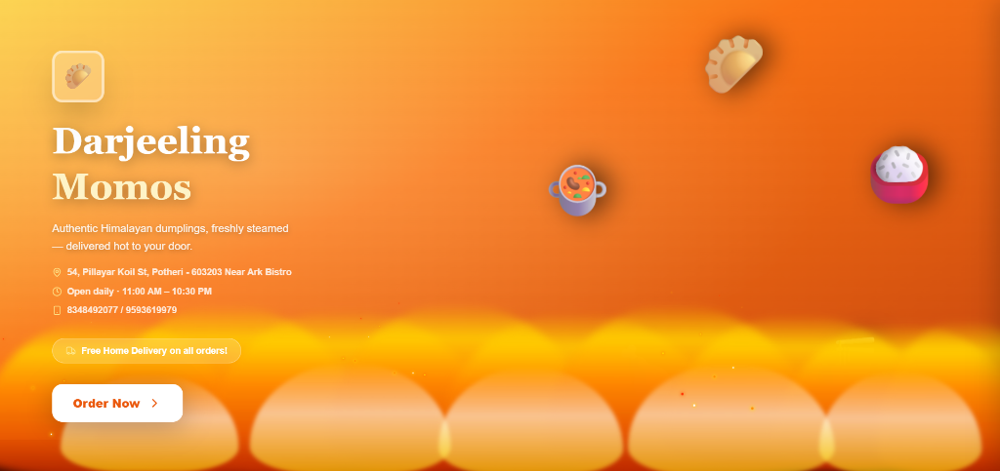

# 🥟 Darjeeling Momos - Premium Delivery Platform

Darjeeling Momos is a full-stack, state-of-the-art food delivery application designed to offer a premium experience for authentic Himalayan cuisine Lovers. Built with a focus on immersive UX, real-time tracking, and cloud-native security.

---

## 📸 Visual Preview

---

## ✨ Key Features

- **🔥 Immersive Landing Page**: Dynamic CSS animations including high-definition flame effects and rotating food elements.
- **🛡️ Secure Cloud Authentication**: Scalable user management powered by **Supabase** with hashed security (bcrypt) and JWT tokens.
- **🛒 Real-time Ordering**: Instant order placement and status updates using **Socket.io**.
- **👨‍🍳 Admin Portal**: Comprehensive dashboard to manage incoming orders, track delivery flows, and configure menu items.
- **👤 Dynamic Profiles**: Swiggy/Zomato-style profile management with locked identifiers (Phone for Customers, Email for Admins).
- **📦 Auto-Order Progression**: Sophisticated server-side cron jobs that automatically advance orders from 'Preparing' to 'Delivered' every 6 minutes.

---

## 🛠️ Technology Stack

| Frontend | Backend | Database |
| :--- | :--- | :--- |
| React 18 | Node.js / Express | Supabase (PostgreSQL) |
| Tailwind CSS | Socket.io | MongoDB (Legacy Compatibility) |
| Zustand (State) | Nodemailer | |
| Lucide Icons | JWT / Bcrypt | |

---

## 📍 Location & Contact

**Address:** 54, Pillayar Koil St, Potheri - 603203 Near Ark Bistro  
**Hours:** 11:00 AM – 10:30 PM (Daily)  
**Phone:** 8348492077 / 9593619979

---

## 🚀 Getting Started

1. **Clone the repo:** `git clone https://github.com/niharrr72/FUTURE_FS_03.git`
2. **Install Server Deps:** `cd server && npm install`
3. **Install Client Deps:** `cd ../client && npm install`
4. **Environment Setup:** Create a `.env` in `server/` with your Supabase keys.
5. **Launch:** `npm run dev`

---

*Made with ❤️ for Darjeeling Momo Lovers.*
